# Entornos de Desarrollo - Examen 1T

Nombre completo: Artur Somoza Piñeiro  
Grupo: DAW

1. Creación de un proyecto de IntelliJ con repositorio Git y código de ejemplo.

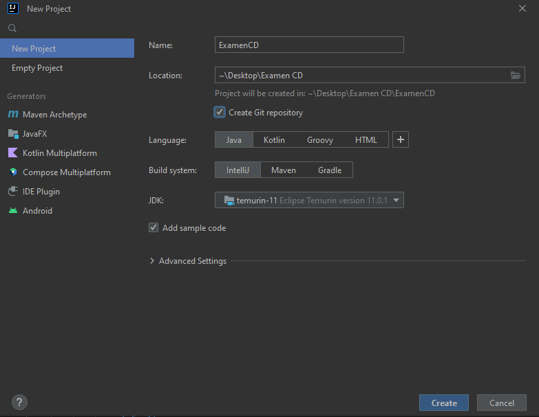

2. Primer commit en master.

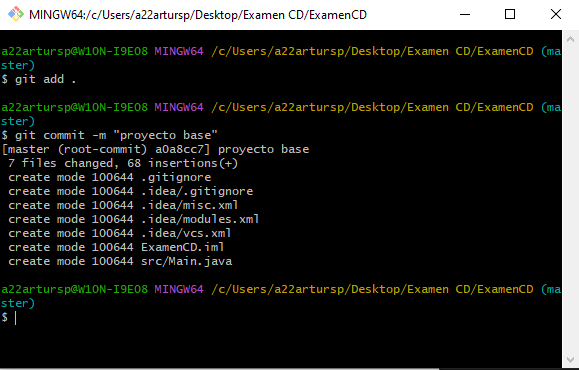

3. Creamos y desarrollamos la rama valor_referencia.

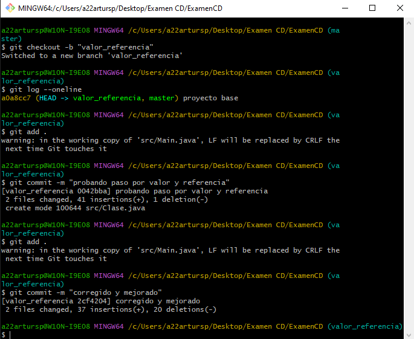

4. Hacemos un push de la rama valor_referencia.

5. Hacemos un merge de esta rama a master.

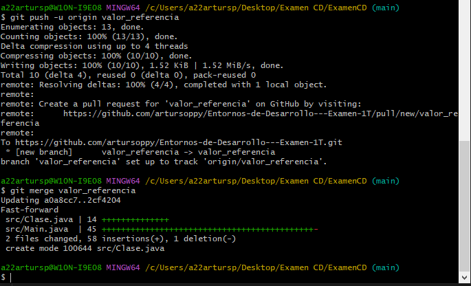

6. Creamos una rama paso_arrays y la desarrollamos.

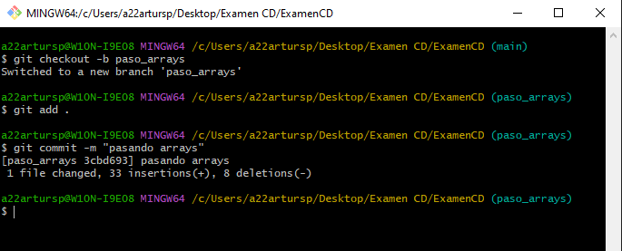

7. Hacemos un merge a master.

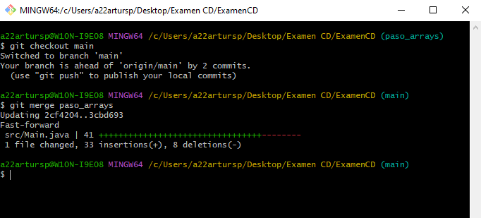

8. Creamos las ramas comparando_objetos y comparando_strings y las desarrollamos.

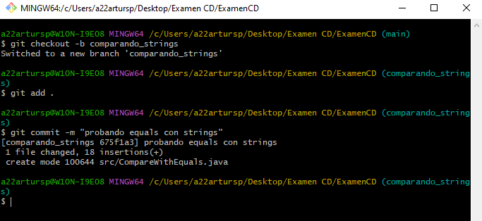

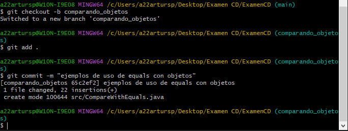

9. Hacemos merge de ambas a master, solventando el conflicto.

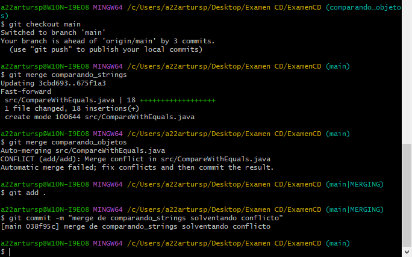

10. Creamos la rama "reestructurando" para reorganizar en paquetes. Una vez desarrollada hacemos merge a master
(es recomendable ver el estado de los ficheros de este commit, más que el diff).

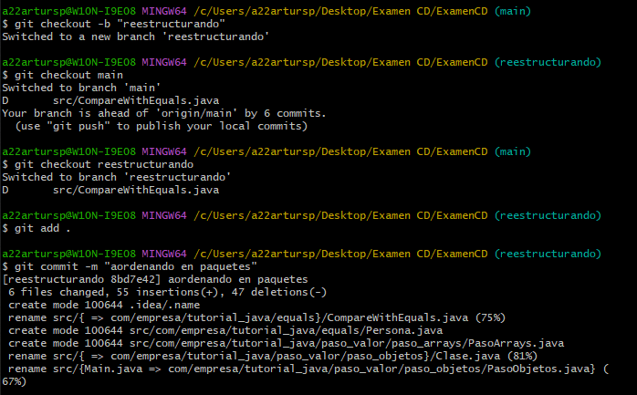

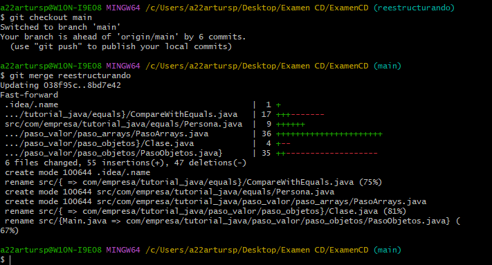

11. Realizamos una corrección menor en valor_referencia y la hacemos un merge a master.

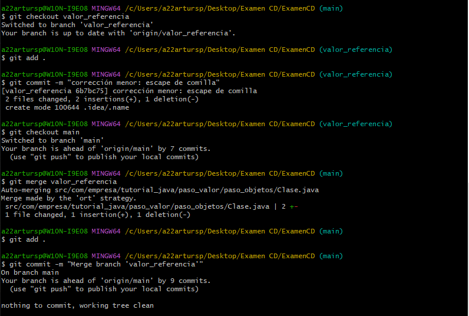

12. Añadimos el README.md (el de cada uno, en vuestro caso).

Todas las ramas deben subirse a GitHub, con master como rama por defecto.